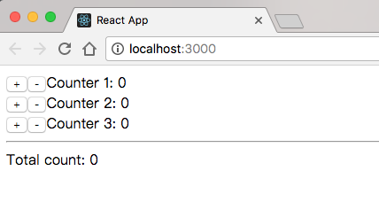

这个库是在学习[React官方文档](https://reactjs.org/docs/hello-world.html)和《深入理解React和Redux》前四章所使用的代码，会实现如上图所示一个很简单的计数器的功能，水平线下面会实时计算三个计数器的总数。

从初学的实现到[lifting state up](https://reactjs.org/docs/lifting-state-up.html)，再使用Flux，最后使用Redux来帮助理解各种框架的基本概念。

-----

# Naive

在master分支中，我们使用最简单的直白的方式来实现它。分为：Counter和ControlPanel两个Component，Counter实现每个计数器，ControlPanel包括三个计数器和总和。

每个计数器的值保存在每个Counter的local state里，总和保存在ControlPanel的state里。ControlPanel在初始化Counter时，通过props把回调传入Counter，来实时更改总和的值。

这种方式初学React的时候很容易想到，但这个实现违反了React的原则：第一，数据在多处存放，Counter和ControlPanel都其实保存了一份Counter的值，这会造成数据同步的问题。也就是官方文档中说的"source of truth"；第二，通过回调的方式来实现让各个模块变得耦合。

下面，我们利用官方文档中lift state up的方法，来解决第一个问题。

# Lifting state up

# Flux

# Redux